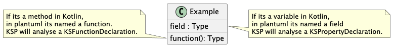

# CONTRIBUTING

## Generate /doc

There is a single test file that contains a bunch of example kotlin code snippets.
A test will compile each of the code snippets and execute the KSP Processor on them.

Each code Snippet is combined with an `Options` instance for configuration and a name,
that will be used for the generated `.puml` file.
Each code snippet will be added to the `.puml` file as a note.

To run the test, execute:
`./gradlew :pumlgenerator:test --tests "docgeneration.GenerationForDoc"`

## Publish
:warning: This should be done only by [Tosaa](https://github.com/tosaa),
since the sonartype account (Step3) must be authenticated for this project.

### Step 1: Repo preparation
For publishing, ensure that the version in the [build.gradle.kts](./pumlgenerator/build.gradle.kts) is set to a new version.
Also ensure that all changes are mentioned in the [Changelog](CHANGELOG.md) file.

### Step 2: Github release
Merge your changes into main and release through the Github CI.  
```
Github -> Releases -> Draft a new Release
```
  
Enter the version number and copy the latest changelog entry.

### Step 3: Verification on Sona
Login on the [maven central repository](https://central.sonatype.com/).
```
Publish -> Select the new version -> Publish component
```

## Implementation

### Terminology
[This is the general plantuml documentation](https://plantuml.com/guide) and this project adopts it.


| Kotlin                         | KSP                            | Plantuml   | Info                                                                                                                     |
|--------------------------------|--------------------------------|------------|--------------------------------------------------------------------------------------------------------------------------|
| Class, Enum, Interface, Object | KSClassDeclaration + classKind | Element    |                                                                                                                          |
| Variable                       | KSPropertyDeclaration          | field      |                                                                                                                          |
| Method                         | KSFunctionDeclaration          | function   |                                                                                                                          |
| Companion & JVMStatic modifier | -                              | {{static}} | Companion variables and methods will be shown as static in plantuml. Same for JVMStatic annotated variables and methods. |

### Architecture

The [PumlProcessor] is setup according the official guidelines.
It runs through a 3 Step process.
1. Analysing and generating plantuml builder for all files and its content
2. Using the generated builder to render a plantuml diagram
3. Saving the generated diagram

### Element Builder
Each KSClassDeclaration will be mapped into a [DiagramElement.Builder].  
The Builder stores information of the KSClassDeclaration and its variables and methods.  
Additionally Companion variables and methods can be added which are then rendered to the same
plantuml element.

Which variables and methods are mapped into the final rendered plantuml element is determined on the [Options].

### Element Builder
Each Relation between a variable and its type, method and its return type will be mapped into a [ElementRelation.Builder].  
The Builder stores information of the variable or method owning KSClassDeclaration and the KSClassDeclaration that is referred to as type or return type.  
Moreover inheritance relations to the superType of a KSClassDeclaration are also setup as [ElementRelation.Builder].

Which relations are mapped into the final rendered plantuml diagram is determined on the [Options].

### Class Mapping
Each Kotlin class type is mapped into a [ElementKind], that holds
the information of how to write the according plantuml code.

The Class name is used as displayed name of the plantuml element.
The package and class name is used as identifier of the plantuml element.

E.g. Kotlin enum:
- identifier = package + Name
- Kotlin `enum class` will setup plantuml `enum` as class type
```
package <package>
enum class <Name> {
...
}
```
E.g. plantuml:
```
enum <Name> as <identifier>{

}
```
