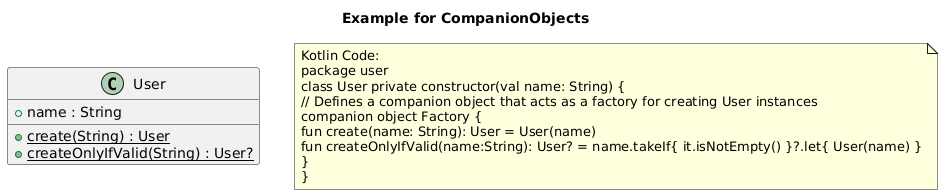
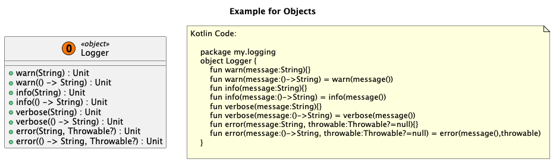

# Kotlin-symbol-processor-plantuml-generator 

Kotlin-symbol-processor-plantuml-generator is designed to configure and create Class Diagrams in the plantuml format, by applying a KSP Plugin on your Project.

## Guideline
1. [Try it out :roller_coaster:](#try-it-out)
2. [Setup :hammer:](#setup)
3. [Examples :books:](#examples)
4. [Configuration options :wrench:](#configuration-options)
5. [Kotlin agnostic Features :mega:](#features)
6. [Contribute :+1:](#contribute)
7. [Changelog :clipboard:](#changelog)
8. [Work in progress](#work-in-progress)


## Try it out
1. Clone this Repository.
2. Run `./gradlew :example:kspKotlin` to generate a Plantuml Classdiagram.  
3. The output can be found at `example/build/resources/main/ClassDiagram.puml`.  

Tghe generated file can be rendered by using the Intellij Plantuml Plugin or on [Plantuml.com](https://plantuml.com/)

***

## Setup
To setup the ksp-plantuml-generator in your repository, KSP itself need to be enabled and setup.
In general it is useful to read the [KSP Quickstart](https://kotlinlang.org/docs/ksp-quickstart.html) to understand whats going on.

1. Add the KSP plugin to your module
```
plugins {
    id("com.google.devtools.ksp") version "2.1.21-2.0.1"
}
```

2. Add the ksp-plantuml-generator dependency
```
dependencies {
    ksp("io.github.tosaa.puml.ksp:ksp-plantuml-generator:0.0.2")
}
```
3. Configure the KSP extension as shown above
4. Run the `ksp-plantuml-generator` by `./gradlew :<modulename>:kspKotlin`
5. Check the output in `<modulename>/build/resources/main/ClassDiagram.puml`

_You can find the artifact here: [central.sonatype.com](https://central.sonatype.com/artifact/io.github.tosaa.puml.ksp/ksp-plantuml-generator/overview)_

**(Optional) Setup your own gradle Task**  
This way you can setup multiple tasks with different ksp configurations to produces various outcomes of diagrams for different purposes.

1. Setup the configuration
```
'build.gradle.kts
val firstExampleConfiguration = mutableMapOf<String, String>().apply {
    // add all your settings here
    put("puml.allowEmptyPackage", "true")
}
```

2. Setup your own task
    - Add all your configuration entries to the ksp action
    - make your task depend on the original kspKotlin task
```
'build.gradle.kts
tasks {
    register("generatePlantumlWithMySettings") {
        ksp {
            firstExampleConfiguration.forEach {
                arg(it.key, it.value)
            }
        }
        dependsOn(findByName("kspKotlin"))
    }
}
```

***

## Examples
### DataClass example


### Companion object example
No additional `Class.Companion` entry is added but companion variables and functions are declared as static for the owning `class`.



### Enums example


### Extensions example
Extension variables and functions can be marked as `<ext>`. Extensions of the Companion object are marked as static as well.


If extension variables and extension functions of classes from dependencies are implemented, their classes are displayed in a concise format.
This approach prevents the diagram from becoming cluttered by including all variables, methods, and inner classes from dependency classes.


### Interface example


### Inheritance example


### Objects example
Since `object` is equal to Singleton in Kotlin, it is highlighted with a red indicating color and the tag `<<object>>`.



### Sealed classes example


### Suspend functions example
Since coroutines and the concept of `suspend` functions is a very important detail in Kotlin, suspend functions can be marked as such in the final diagram as well. 


### Many types of relations example
Indirect relations like the Type of elements in a List or the Type of Result can be resolved too.
- Direct properties are visualized as solid line ending with a diamond.
- Indirect properties are visualized as dotted line ending with a diamond.
- Direct Function return types are visualized as solid line ending with an arrow.
- Indirect Function return types are visualized as dotted line ending with an arrow.


If a class has to many relations the diagram can get very hard to read.
Instead all relations will be hidden and a note will be added.


***

## Configuration options
The following options can be set using ksp.

Key | Default                                              | Description
--|------------------------------------------------------|--
`puml.includedPackages` | `emptyList`                                          | If nothing is specified, all packages are taken into account for the generation.
`puml.excludedPackages` | `emptyList`                                          | Exclude packages that would be included otherwise.
`puml.excludedClassNames` | `emptyList`                                          | Exclude classes by name
`puml.excludedPropertyNames` | `emptyList`                                          | Exclude variables by name
`puml.excludedFunctionNames` | `listOf("<init>", "toString", "equals", "hashCode")` | Exclude functions by name
`puml.allowEmptyPackage` | `false`                                              | Allow/Deny classes without a package
`puml.showVisibilityModifiers` | `true`                                               | Show/Hide visiblity modifiers indicated by +/#/-
`puml.markExtensions` | `true`                                               | Show/Hide information that a variable/function is an extension variable / function
`puml.showExtensions` | `true`                                               | Show/Hide extension variables / function
`puml.showPublicClasses` | `true`                                               | Allow/Ignore public classes
`puml.showPublicProperties` | `true`                                               | Allow/Ignore public variables
`puml.showPublicFunctions` | `true`                                               | Allow/Ignore public functions
`puml.showInternalClasses` | `true`                                               | Allow/Ignore internal classes
`puml.showInternalProperties` | `true`                                               | Allow/Ignore internal variables
`puml.showInternalFunctions` | `true`                                               | Allow/Ignore internal functions
`puml.showPrivateClasses` | `true`                                               | Allow/Ignore private classes
`puml.showPrivateProperties` | `true`                                               | Allow/Ignore private variables
`puml.showPrivateFunctions` | `true`                                               | Allow/Ignore private functions
`puml.showInheritance` | `true`                                               | Show Inheritance of classes by drawing Arrows
`puml.showPropertyRelations` | `true`                                               | Show Relations of variables by drawing Arrows when the type could be resolved and is shown as class in the diagram
`puml.showFunctionRelations` | `false`                                              | Show Relations of functions by drawing Arrows when the return type of the function could be resolved and is shown as class in the diagram. Parameters of the function are not drawn.
`puml.showIndirectRelations` | `true`                                               | Show Relations of functions and properties that are resolved indirectly. E.g. The the type of elements contained in a list is shown as dotted line if the option is activated.
`puml.maxRelations` | `6`                                                  | Sets the limit when relations of a class should not be drawn anymore. If a class has more relations that the given value, the classes relations will not be shown. The default value is set to 6.
`puml.showPackages` | `false`                                              | Group classes that are in the same package
`puml.prefix` | ``                                                   | Add a custom prefix to the plantuml diagram
`puml.postfix` | ``                                                   | Add a custom postfix to the plantuml diagram
`puml.title` | ``                                                   | Add a custom title to the plantuml diagram

```

val visualizePublicAPIConfiguration = mutableMapOf<String, String>().apply {
    put("puml.title", "Public API")
    put(
        "puml.prefix", """
skinparam class {
    BackgroundColor #fdf0d5
    classFontSize 16
    ArrowColor 003049
    BorderColor 003049
    FontColor 003049
    FontSize 20
}
    """.trimMargin()
    )
    
    put("puml.excludedFunctionNames", "<init>,equals,hashCode,toString")
    put("puml.showVisibilityModifiers", "false")
    // Only keep public API
    put("puml.showPublicClasses", "true")
    put("puml.showPublicProperties", "true")
    put("puml.showPublicFunctions", "true")
    // Hide internal and private 
    put("puml.showInternalClasses", "false")
    put("puml.showInternalProperties", "false")
    put("puml.showInternalFunctions", "false")
    put("puml.showPrivateClasses", "false")
    put("puml.showPrivateProperties", "false")
    put("puml.showPrivateFunctions", "false")
    // Actively show inheritance but skip property/function relations
    put("puml.showInheritance", "true")
    put("puml.showPropertyRelations", "false")
    put("puml.showFunctionRelations", "false")
    // Show packages since they might be helpful for the API consumer
    put("puml.showPackages", "true")
    put("puml.allowEmptyPackage", "false")
}

ksp {
    // Add all configured options to the KSP environment
    visualizePublicAPIConfiguration.forEach {
        arg(it.key, it.value)
    }
}
```

***

## Features
### Visualize inheritance, relations and dependencies
Use the KSP plantuml generated UML diagrams to visualize
the inheritance hierarchy of your classes,
showcasing the parent-child relationships and
to identify dependencies within your classes.

### Filter classes, functions and variables according their visibility
KSP plantuml generator configuration options provides granular control over visibility modifiers.
For example one can focus on the public interface of the codebase by disabling private and internal classes, variables and functions.
If one wants to dig deeper into internal or private implementation details all visibility modifiers can be enabled.

you can individually enable or disable the visibility of:
- Public classes, functions, and variables
- Internal classes, functions, and variables
- Private classes, functions, and variables

### Kotlin-Specific Support for Accurate UML

KSP plantuml generator is taking into account Kotlin's unique features and language nuances.
When generating UML diagrams, it is ensured that the following Kotlin-specific elements are accurately represented:
- Sealed classes: Sealed classes are displayed with their subclasses.
- Suspend functions: Suspend functions are also indicated in the UML diagram as such.
- Companion objects as static: Variables and Functions of Companion objects are identified as static elements.

### Customize the packages used for the UML Diagram

Take control of which packages should be used for your UML diagrams by setting:
- Specify used packages: Specify specific packages that should be used for the UML diagram.
- Excluded packages: Hide packages that should not be part of the UML diagram.
- Include/Exclude empty packages: Decide whether to include or exclude empty packages for the UML diagram.

## Contribute
If you have any suggestions for improvements, new features or bugs please report these as an [issue](https://github.com/Tosaa/ksp-plantuml/issues).

## Changelog
Please check the [Changelog file](https://github.com/Tosaa/ksp-plantuml/blob/main/CHANGELOG.md) to see the changes of the latest releases.

## Work in progress
_Here is a list of topics that can be improved:_
- Android compatibility is not well right now
  - Generated Diagrams are getting very big
  - Android dependencies are referenced to other Android dependencies, which is a lot overhead
- Examples could be autogenerated by [using Plantuml encoding and server API calls](https://plantuml.com/text-encoding)
- Extension functions on classes in external libraries cause entire class to be rendered
  - Instead, one could expect, that only the new added extension function is shown and not the entire class