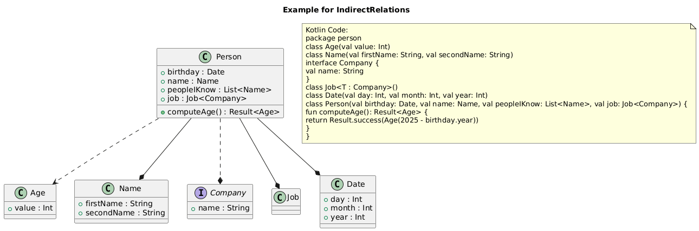
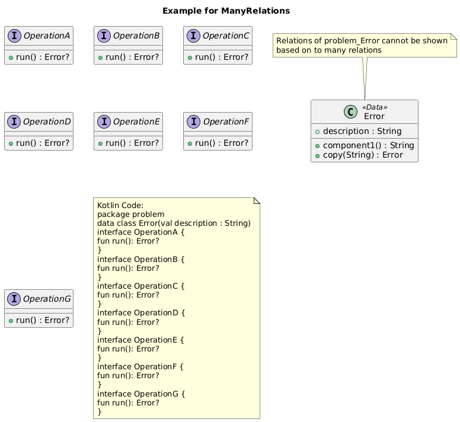

# Kotlin PlantUML Generator

> A **Gradle plugin** that generates **PlantUML** code from **Kotlin source files** to help you create **accurate, up-to-date UML diagrams** for your project.

---

## 📦 Overview

This plugin is designed to automatically generate **PlantUML** code from your Kotlin codebase using the **Kotlin Symbol Processing API (KSP)**. The generated `.puml` files can be rendered using tools like `plantuml`, online editors, or IDE integrations.

The plugin is **open source**, **privacy-focused**, and **highly customizable**, allowing you to control what parts of your code are included in the diagrams.

---

## 🎯 Purpose

- Provide a **clear overview** of your Kotlin class structure.
- Help **API readers** quickly understand class relationships.
- Ensure **diagrams stay up to date** with your codebase.
- Avoid **data privacy issues** by not sending any user data to third parties.

---

## 🔧 Features

- ✅ **KSP-based symbol processing** for accurate Kotlin code analysis.
- ✅ **Customizable configuration** (e.g., visibility filters, name exclusions, package grouping, ...).
- ✅ **Integrated with Gradle** — runs on every build.
- ✅ **Privacy-first** — only generates `.puml` code, no data is sent to third parties.
- ✅ **Open source** — contribute and extend the plugin!

---

## 📌 Supported Kotlin Features

- Sealed classes
- Object declarations
- companion objects
- Suspend functions
- Extension functions
- Visibility modifiers (public, internal, private)
- Custom filtering of elements by name or package
- Collection element type resolving
- Generic element type resolving
- ...

---

### ⚒️ Try it out

1. Clone this Repository.
2. Run `./gradlew :example:kspKotlin` to generate a Plantuml Classdiagram.  
3. The output can be found at `example/build/resources/main/ClassDiagram.puml`.  

The generated file can be rendered by using the Intellij Plantuml Plugin or on [Plantuml.com](https://plantuml.com/)

---

## 📦 Installation

Add the plugin to your `build.gradle.kts`:

```kotlin
plugins {
    id("com.google.devtools.ksp") version "2.1.21-2.0.1"
}

dependencies {
    ksp("io.github.tosaa.puml.ksp:ksp-plantuml-generator:0.0.+")
}

```

---

## 🚀 Getting Started

### 1. **Add the Plugin to Your Project**

Add the plugin to your `build.gradle.kts` file:


```kotlin
plugins {
    id("com.google.devtools.ksp") version "2.1.21-2.0.1"
}

dependencies {
    ksp("io.github.tosaa.puml.ksp:ksp-plantuml-generator:0.0.+")
}

```

### 2. **Run the Gradle Task**

Run the following command to generate PlantUML code:

```bash
./gradlew :<modulename>:kspKotlin
```

> This will generate `.puml` files in the `<modulename>/build/resources/main/` directory by default.

### 3. **Render the Diagrams**

Use a tool like the [PlantUML CLI](https://plantuml.com/overview) or an online editor like [PlantUML Editor](https://www.plantuml.com/plantuml/uml) to render the `.puml` files.

---

## 🛠️ Configuration

You can customize the plugin's behavior by 
passing a customized KSP configuration within the Kotlin-DSL 
or writing a configuration file 
and setup a custom gradle task.

### Example Configuration by configuration file
1. Define all required options in a file

MyConfig.conf
```
# comment
; comment
puml.allowEmptyPackage=true
```

2. Reference the file in a custom gradle task

```kotlin
tasks {
    register("generatePlantumlWithMySettings") {
        ksp {
            arg("puml.configFilePath", layout.projectDirectory.file("myConfig.conf").asFile.path)
        }
        dependsOn(findByName("kspKotlin"))
    }
}
```

The configuration file is based on the [INI file schema](https://en.wikipedia.org/wiki/INI_file).
- Lines beginning with ; and # are interpreted as comments
- key and value settings are separated with '='
- Packages and Names can be separated with ','
- Boolean settings can be set with 'true' and 'false'

### Example Configuration within Kotlin-DSL

```kotlin
val customizedPlantumlConfiguration = mutableMapOf<String, String>().apply {
    // add all your settings here
    put("puml.allowEmptyPackage", "true")
}

tasks {
    register("generatePlantumlWithMySettings") {
        ksp {
            customizedPlantumlConfiguration.forEach {
                arg(it.key, it.value)
            }
        }
        dependsOn(findByName("kspKotlin"))
    }
}
```

---

## 📚 Configuration Guide

### Configuration Templates

- [Default configuration](doc/default.conf) as .conf file _- is always a good way to start_
- [Public API configuration](doc/publicAPI.conf) as .conf file _- probably the best suitable configuration when you want to visualize your library_

<details>
<summary>KSP configuration for public API</summary>

```

val visualizePublicAPIConfiguration = mutableMapOf<String, String>().apply {
    put("puml.title", "Public API")
    put(
        "puml.prefix", """
skinparam class {
    BackgroundColor #fdf0d5
    classFontSize 16
    ArrowColor 003049
    BorderColor 003049
    FontColor 003049
    FontSize 20
}
    """.trimMargin()
    )
    
    put("puml.excludedFunctionNames", "<init>,equals,hashCode,toString")
    put("puml.showVisibilityModifiers", "false")
    // Only keep public API
    put("puml.showPublicClasses", "true")
    put("puml.showPublicProperties", "true")
    put("puml.showPublicFunctions", "true")
    // Hide internal and private 
    put("puml.showInternalClasses", "false")
    put("puml.showInternalProperties", "false")
    put("puml.showInternalFunctions", "false")
    put("puml.showPrivateClasses", "false")
    put("puml.showPrivateProperties", "false")
    put("puml.showPrivateFunctions", "false")
    // Actively show inheritance but skip property/function relations
    put("puml.showInheritance", "true")
    put("puml.showPropertyRelations", "true")
    put("puml.showFunctionRelations", "false")
    put("puml.showIndirectRelations", "true")
    // Show packages since they might be helpful for the API consumer
    put("puml.showPackages", "true")
    put("puml.allowEmptyPackage", "false")
}

ksp {
    // Add all configured options to the KSP environment
    visualizePublicAPIConfiguration.forEach {
        arg(it.key, it.value)
    }
}
```


</details>

### List of Configuration Options

The following options can be set.

Key | Default                                              | Description
--|------------------------------------------------------|--
`puml.includedPackages` | `emptyList`                                          | If nothing is specified, all packages are taken into account for the generation.
`puml.excludedPackages` | `emptyList`                                          | Exclude packages that would be included otherwise.
`puml.excludedClassNames` | `emptyList`                                          | Exclude classes by name
`puml.excludedPropertyNames` | `emptyList`                                          | Exclude variables by name
`puml.excludedFunctionNames` | `listOf("<init>", "toString", "equals", "hashCode")` | Exclude functions by name
`puml.allowEmptyPackage` | `false`                                              | Allow/Deny classes without a package
`puml.showVisibilityModifiers` | `true`                                               | Show/Hide visiblity modifiers indicated by +/#/-
`puml.markExtensions` | `true`                                               | Show/Hide information that a variable/function is an extension variable / function
`puml.showExtensions` | `true`                                               | Show/Hide extension variables / function
`puml.showPublicClasses` | `true`                                               | Allow/Ignore public classes
`puml.showPublicProperties` | `true`                                               | Allow/Ignore public variables
`puml.showPublicFunctions` | `true`                                               | Allow/Ignore public functions
`puml.showInternalClasses` | `true`                                               | Allow/Ignore internal classes
`puml.showInternalProperties` | `true`                                               | Allow/Ignore internal variables
`puml.showInternalFunctions` | `true`                                               | Allow/Ignore internal functions
`puml.showPrivateClasses` | `true`                                               | Allow/Ignore private classes
`puml.showPrivateProperties` | `true`                                               | Allow/Ignore private variables
`puml.showPrivateFunctions` | `true`                                               | Allow/Ignore private functions
`puml.showInheritance` | `true`                                               | Show Inheritance of classes by drawing Arrows
`puml.showPropertyRelations` | `true`                                               | Show Relations of variables by drawing Arrows when the type could be resolved and is shown as class in the diagram
`puml.showFunctionRelations` | `false`                                              | Show Relations of functions by drawing Arrows when the return type of the function could be resolved and is shown as class in the diagram. Parameters of the function are not drawn.
`puml.showIndirectRelations` | `true`                                               | Show Relations of functions and properties that are resolved indirectly. E.g. The the type of elements contained in a list is shown as dotted line if the option is activated.
`puml.maxRelations` | `6`                                                  | Sets the limit when relations of a class should not be drawn anymore. If a class has more relations that the given value, the classes relations will not be shown. The default value is set to 6.
`puml.showPackages` | `false`                                              | Group classes that are in the same package
`puml.prefix` | ``                                                   | Add a custom prefix to the plantuml diagram
`puml.postfix` | ``                                                   | Add a custom postfix to the plantuml diagram
`puml.title` | ``                                                   | Add a custom title to the plantuml diagram
`puml.outputFileName` | ``                                                   | Set custom file within /build/generated/ksp/main/resources
`puml.configFilePath` | ``                                                   | Apply config file with all above described configurations

---

## 📚 Examples

### DataClass example


### Companion object example
No additional `Class.Companion` entry is added but companion variables and functions are declared as static for the owning `class`.


### Enums example


### TypeAlias example


### Extensions example
Extension variables and functions can be marked as `<ext>`. Extensions of the Companion object are marked as static as well.


If extension variables and extension functions of classes from dependencies are implemented, their classes are displayed in a concise format.
This approach prevents the diagram from becoming cluttered by including all variables, methods, and inner classes from dependency classes.


### Interface example


### Inheritance example


### Objects example
Since `object` is equal to Singleton in Kotlin, it is highlighted with a red indicating color and the tag `<<object>>`.


### Sealed classes example


### Suspend functions example
Since coroutines and the concept of `suspend` functions is a very important detail in Kotlin, suspend functions can be marked as such in the final diagram as well. 


### Many types of relations example
Indirect relations like the Type of elements in a List or the Type of Result can be resolved too.
- Direct properties are visualized as solid line ending with a diamond.
- Indirect properties are visualized as dotted line ending with a diamond.
- Direct Function return types are visualized as solid line ending with an arrow.
- Indirect Function return types are visualized as dotted line ending with an arrow.



If a class has to many relations the diagram can get very hard to read.
Instead all relations will be hidden and a note will be added.



---

## 📥 Contributing & 📧 Contact


If you have any questions, feature requests, or need help, feel free to report these as an [issue](https://github.com/Tosaa/ksp-plantuml/issues).

**Open Topics & Ideas:**

- Create Option to hide Relations for given classes
- Create Option to generated output file to given path
- Bug: Indirect Relations do not exclude classes that are not in included packages

---

## 📋 Changelog

Please check the [Changelog file](https://github.com/Tosaa/ksp-plantuml/blob/main/CHANGELOG.md) to see the changes of the latest releases.

---

## 📌 License

This project is licensed under the **Apache License, Version 2.0** — see the [LICENSE](LICENSE) file for details.

---
